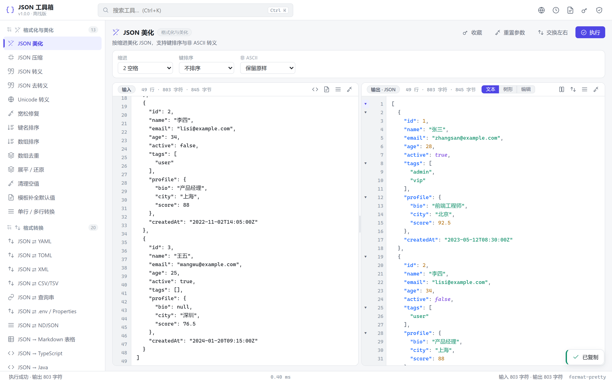
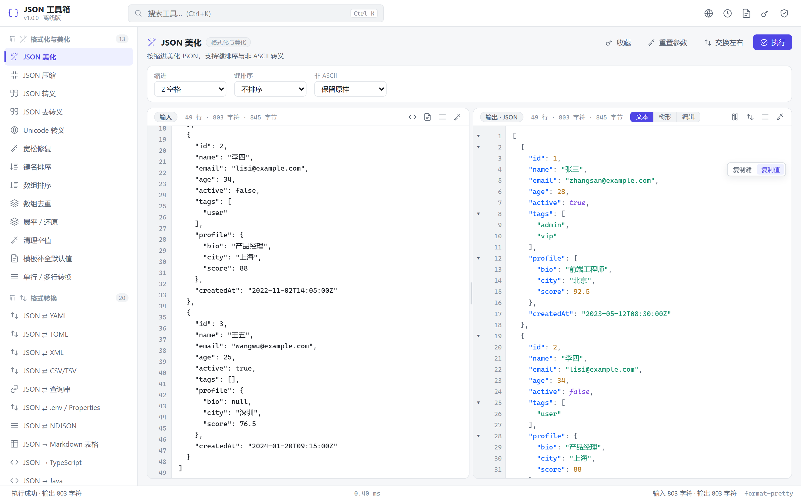
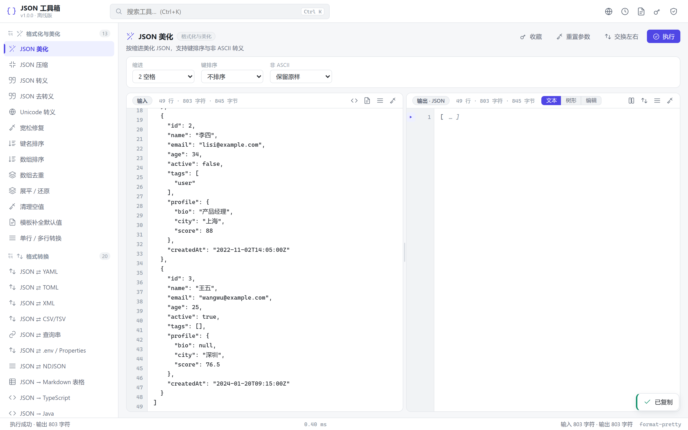
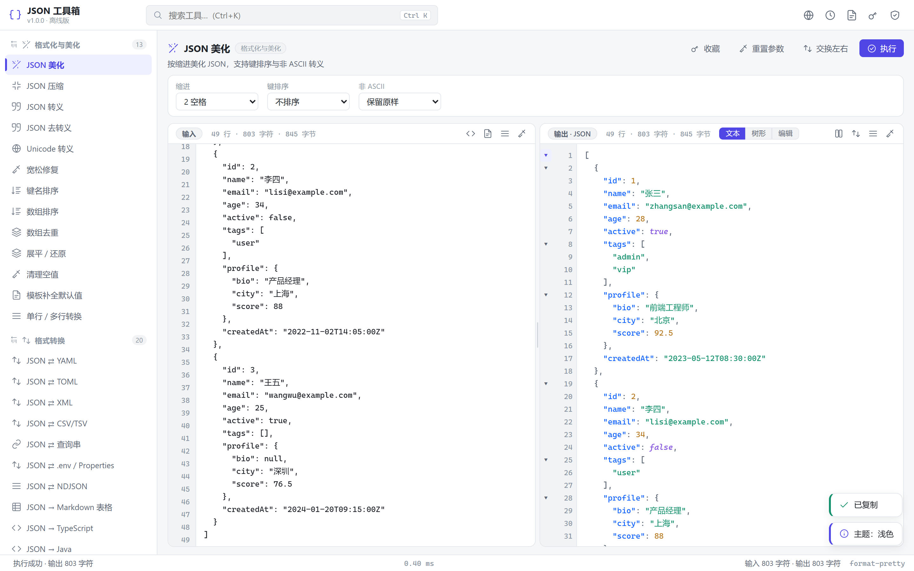

# JSON 工具箱

一个**完全离线**的 Windows 桌面版 JSON 处理工具。纯静态前端（原生 JavaScript，无框架、无 CDN）+
Python 桌面外壳，内置 **68 个**实用工具，覆盖 JSON 的格式化、格式转换、查询提取、校验分析、编码安全与日常处理。

> 无需联网即可使用；所有第三方库（js-yaml / yaml / smol-toml）已用 esbuild 打包进 `web/vendor/libs.js`。

---

## 界面预览

| 主界面（浅色 · JSON 美化） | 折叠 + 悬浮复制条 |
| --- | --- |
|  |  |
| **折叠态（▸ 高亮 + `… ]` 省略）** | **深色主题** |
|  |  |

- **左图（主界面）**：左侧工具分类导航 + 顶部搜索（Ctrl+K），输入 / 输出双面板带行号与语法高亮。
- **右上（折叠与复制）**：输出文本视图中，行号槽的块首行有折叠箭头；悬停任意行，右侧浮出「复制键 / 复制值 / 复制对象」悬浮条。
- **左下（折叠态）**：点击 ▾ 后整块折叠为一行（显示 ` … ]` 省略标记），箭头变为主色 ▸，再次点击展开；嵌套块各自独立。
- **右下（深色主题）**：全应用支持浅色 / 深色一键切换。
- 输出框支持原地编辑（点「编辑」→ 文本域可改 → 点「查看」应用），见 [docs/screenshots/06-output-editing.png](docs/screenshots/06-output-editing.png)。
- 树形视图（JSONPath 查询等工具默认使用）支持节点「复制路径 / 复制值」，见 [docs/screenshots/05-tree-view.png](docs/screenshots/05-tree-view.png)。

---

## 一、三种使用方式

### 方式 1：双击 `启动.bat`（推荐）
自动探测 Python 并以**无控制台窗口**的原生窗口（pywebview）打开。若未检测到可用的 Python，会**自动改用方式 2**（发行包自带 `dist\JSON工具箱.exe` 时）；两者都不可用时，会提示改用方式 3，并提示安装 Python。

### 方式 2：直接双击 `dist\JSON工具箱.exe`（无需 Python，推荐）
**单文件程序，双击即用、无需安装任何 Python**，能力与方式 1 一致（本地 HTTP 服务 + 原生窗口 / 浏览器）。当 `启动.bat` 找不到可用 Python 时，也会自动改用本 exe。
> 说明：exe 已随本仓库提供（见「发行产物与质量报告」），可直接下载使用；也可随时用 `打包EXE.bat` 从源码重新打包。

### 方式 3：直接双击 `web/index.html`
无需任何依赖，用系统浏览器打开即可使用（`file://` 协议）。
> 注意：「哈希计算」依赖浏览器的 WebCrypto（`crypto.subtle`）。现代 Edge / Chrome / Firefox 即使在 `file://` 下通常也可用；仅当所在环境确实禁用了该能力时才会给出友好提示。此外 `file://` 下剪贴板读取可能受限，需要最完整的能力请用方式 1 / 2。

### 小贴士：输出视图（文本 / 树形）与折叠复制
输出面板标题栏右侧提供「文本 / 树形」切换：当结果本身是 JSON 对象或数组时，可一键切换为可折叠的树形视图（`JSONPath 查询` 等工具默认即用树形）；结果本身不含 JSON 结构时该按钮置灰，悬停会给出说明。

当输出为 JSON 时，**文本视图**本身也具备结构化能力：

- **直接编辑**：点输出面板右上角的「编辑」，输出框即刻变为可编辑文本域（面板高亮提示、标题显示「编辑中」），改完点「查看」按新内容重新渲染——若仍是合法 JSON 会自动恢复折叠与高亮，非法内容则降级为纯文本显示且不会报错；编辑期间「复制输出 / 下载输出 / 结果作为新输入」均按编辑后的内容生效。
- **折叠 / 展开**：行号槽在对象 `{` / 数组 `[` 的块首行显示折叠箭头，点击可把整块折叠为一行（显示 ` … }` 省略标记），再次点击展开；嵌套块各自独立折叠，展开外层后内层保持原状。
- **按元素复制**：鼠标悬停任意行，右侧会出现悬浮复制条——
  - 键值行（`"name": "张三"`）：**复制键**（不含引号）、**复制值**（字符串自动去引号转义）；
  - 对象 / 数组块首行（含 `"key": {` 这类带键的）：**复制键**、**复制对象 / 复制数组**（完整源码片段，自动去掉尾随逗号，结果可直接作为合法 JSON 使用）；
  - 数组中的标量项（如 `"admin",`）：**复制值**。
- 树形视图同样支持每个节点「复制路径 / 复制值」，两种视图按需选用。

---

## 二、功能总览（68 个工具）

### 1. 格式化与美化（`format`）
| 工具 | 说明 |
| --- | --- |
| JSON 美化 | 缩进 2/4/8/Tab，键排序（A→Z / Z→A），非 ASCII 转义 |
| JSON 压缩 | 去除全部空白，可选 Unicode 转义 |
| JSON 转义 | 转成可嵌入 JSON 字符串的字面量 |
| JSON 去转义 | 还原 `\n \t \" \\ \uXXXX` 等 |
| Unicode 转义 | 中文 ⇄ `\u4e2d`，可仅转义非 ASCII |
| 宽松修复 | 单引号、尾逗号、注释、裸键、NaN/Infinity、中文引号一键修复，并列出修复类别 |
| 键名排序 | 按字母排序，可递归 |
| 数组排序 | 按元素值或指定字段，支持数字优先 |
| 数组去重 | 按值或字段去重 |
| 展平 / 还原 | `{"a":{"b":1}}` ⇄ `{"a.b":1}` |
| 清理空值 | 删除 null / 空串 / 空数组 / 空对象（可多选） |
| 模板补全默认值 | 按模板 JSON 补齐缺失字段 |
| 单行 / 多行转换 | 单行 ⇄ 多行，可展开字面量 `\n` |

### 2. 格式转换（`convert`）
| 工具 | 说明 |
| --- | --- |
| JSON ⇄ YAML | 双向，支持缩进与长行折叠 |
| JSON ⇄ TOML | 双向；TOML 无 null，会给出丢弃告警 |
| JSON ⇄ XML | 双向，可配置根节点/数组项/属性前缀/文本键 |
| JSON ⇄ CSV/TSV | 双向，分隔符、表头、嵌套处理可选 |
| JSON ⇄ 查询串 | 双向，支持 `a.b=1` 与 `a[]=1` / 重复键 |
| JSON ⇄ .env / Properties | 双向，分隔符可选 |
| JSON ⇄ NDJSON | JSON 数组与 JSON Lines 双向 |
| JSON → Markdown 表格 | 可按数据路径选择 |
| JSON → TypeScript | interface，嵌套拆分、可选字段、命名风格 |
| JSON → Java | POJO，Lombok / Jackson 注解可选 |
| JSON → Kotlin | data class |
| JSON → Go | struct + json tag，指针/值可选 |
| JSON → Python | dataclass / Pydantic / TypedDict |
| JSON → C# | class + JsonPropertyName |
| JSON → Rust | struct + serde derive / rename |
| JSON → Swift | Codable + CodingKeys |
| JSON → Dart | class + fromJson/toJson |
| JSON → PHP | 带类型属性的 class |
| JSON → 建表 DDL | MySQL / PostgreSQL / SQLite，含类型推断注释 |
| JSON → JSON Schema | Draft 2020-12，含 type/required/format 推断 |

### 3. 查询与提取（`query`）
| 工具 | 说明 |
| --- | --- |
| JSONPath 查询 | `$` `.key` `[n]` `[*]` `..key` `[start:end]` `*` |
| 列出所有叶子路径 | 点号 / JSONPath 两种风格 |
| 按路径取值 | `a.b[0].c` 与 `$.a.b[0]` 均可 |
| 键名搜索 | 模糊 / 正则，可区分大小写 |
| 值搜索 | 包含 / 等于 / 正则，支持类型过滤 |
| 递归收集同名键 | 支持多 key |
| 只保留指定键 | 递归删除其他 key |
| 删除指定键 | 递归删除，支持 `*` 通配 |
| 字段投影 pluck | 如 `name`、`items[].id` |
| 分组 groupBy | 分组计数 + 分组结果 |
| 数值聚合 | count / sum / avg / min / max |
| 深合并两个 JSON | 覆盖 / 保留 / 数组拼接 |
| 应用 JSON Patch | RFC6902：add/remove/replace/move/copy/test |

### 4. 校验与分析（`validate`）
| 工具 | 说明 |
| --- | --- |
| JSON 语法校验 | 精确到行列 + 上下文片段 + 一键定位 |
| 重复键检测 | 检测同对象内的重复键并给出路径 |
| JSON Schema 校验 | 内置轻量校验器，逐条列出错误路径 |
| 结构统计 | 节点数/深度/类型分布/Key 频次/数组长度分布/体积 |
| 体积对比 | 原文 vs 格式化 vs 压缩的字节数与压缩率 |
| 异常值检查 | null/空值/超大整数/超深嵌套/可疑日期/超长字符串 |
| 安全检查 | 敏感字段名、明文密码、JWT 明文提示 |
| JSON 差异对比 | 按路径列出 新增/删除/修改，左右对照高亮 |
| 生成精简示例 | 截断长数组与长字符串 |

### 5. 编码与安全（`codec`）
| 工具 | 说明 |
| --- | --- |
| Base64 编解码 | UTF-8 安全，支持 URL-safe / 去 padding / 换行 |
| URL 编解码 | encodeURIComponent / encodeURI / 查询串 → JSON |
| HTML 实体编解码 | `&amp; &lt; &#39; &#x4e2d;` |
| JWT 解码 | 解析 Header/Payload，自动转换 exp/iat/nbf 并判断过期 |
| 时间戳 ⇄ 日期 | 秒/毫秒自动识别，时区可设 |
| 哈希计算 | SHA-1 / SHA-256 / SHA-384 / SHA-512（WebCrypto） |
| UUID / 随机 ID | UUID v4 / NanoID / 短随机 ID |
| 正则测试器 | 匹配列表、位置、分组捕获 |
| 字符串字面量转换 | 普通文本 ⇄ JSON ⇄ JS 单引号 ⇄ C 风格 |

### 6. 实用工具（`utility`）
| 工具 | 说明 |
| --- | --- |
| Mock 数据生成 | 按结构生成随机数据，可设种子 |
| 随机打乱 / 取样 | 打乱数组或随机取样 N 条 |
| 数组分块 | 按每 N 条切分 |
| 大数组抽样 | 前 N 条 / 随机 N 条 / 按步长 |

---

## 三、快捷键

| 键位 | 功能 |
| --- | --- |
| `Ctrl + Enter` | 执行当前工具 |
| `Ctrl + Shift + C` | 复制输出 |
| `Ctrl + K` | 聚焦搜索框 |
| `Ctrl + S` | 下载输出 |
| `Ctrl + B` | 折叠 / 展开侧栏 |
| `Ctrl + D` | 切换主题（浅色 / 深色 / 跟随系统） |
| `Esc` | 关闭弹窗 |
| `Alt + ↑ / ↓` | 上一个 / 下一个工具 |
| `Tab`（编辑区内） | 插入两个空格 |

---

## 四、目录结构

```
JSON工具箱/
├── 启动.bat              双击启动（隐藏控制台，优先原生窗口；无 Python 时自动改用 dist\JSON工具箱.exe）
├── 打包EXE.bat           可选：PyInstaller 打包单文件 exe（产物 dist\JSON工具箱.exe）
├── main.py               Python 桌面外壳（本地静态服务 + pywebview）
├── README.md             本文件
├── dist/                 发行产物：JSON工具箱.exe（单文件、免 Python，与源码逐字节一致性校验）
├── assets/               应用图标（app.ico 用于 exe 与窗口，icon_preview.png 为预览图）
├── .icon/gen_icon.py     图标生成脚本（纯代码绘制，改配色后重跑即可再生成）
├── .qa/                  质量报告与测试套件（测试报告 / 可复跑脚本 / 结果 JSON / 界面截图）
└── web/                  纯静态前端（可直接双击 index.html）
    ├── index.html        SPA 主壳（全部经典 <script>，无 ES module）
    ├── favicon.png       网页图标（与 app.ico 同源设计）
    ├── vendor/
    │   └── libs.js       离线依赖包（js-yaml / yaml / smol-toml）
    ├── css/
    │   ├── tokens.css    设计令牌 + 浅/深双主题
    │   ├── layout.css    应用骨架布局
    │   └── components.css 组件样式
    └── js/
        ├── core/         纯逻辑层（零 DOM 依赖，可被 Node 直接加载）
        │   ├── json.js       解析/修复/格式化/排序/去重/深合并/diff/统计/路径/JSONPath
        │   ├── convert.js    YAML/TOML/XML/CSV/查询串/Properties/NDJSON/Markdown
        │   ├── codegen.js    类型推断 + 10 种语言 + DDL + JSON Schema + Mock
        │   ├── codec.js      Base64/URL/HTML/JWT/时间戳/哈希/UUID/正则/字面量
        │   └── analyze.js    Schema 校验/安全/结构/异常值
        ├── ui/           界面层
        │   ├── dom.js        轻量 DOM 工具
        │   ├── toast.js      轻提示
        │   ├── editor.js     行号编辑器 + 高亮层 + 树形视图 + 可拖拽分栏
        │   ├── modal.js      弹窗 / 确认框
        │   └── storage.js    localStorage 持久化
        ├── tools-registry.js 工具注册表（声明式，68 个工具）
        └── app.js            装配层（布局/路由/事件/快捷键/状态栏）
```

### 发行产物与质量报告（随仓库提供）

**`dist/JSON工具箱.exe`** —— 可直接下载使用的单文件程序：
- 零依赖：内嵌全部前端资源与 Python 运行时，目标机器**无需安装 Python**；
- 与源码一致：打包后已通过 PyInstaller 归档解包比对，内嵌 `web/` 资源与仓库源码**逐字节一致**；
- 更新方式：修改源码后运行 `打包EXE.bat` 即可重新生成。

**`.qa/`** —— 四轮「证伪式」质量验证的全部产物：

| 文件 / 目录 | 说明 |
| --- | --- |
| `report.md` | 完整测试报告（Round 1–4：缺陷清单、分级、修复核验、遗留项） |
| `run-tests.mjs` | 单元/静态测试套件，**290 条断言**（覆盖解析、修复、7 种格式双向往返、代码生成、校验、编码等），可用 Node 直接复跑：`node .qa/run-tests.mjs` |
| `browser-check.mjs` | 真实浏览器端到端测试（playwright-core + Edge），**67 条断言**，用法见文件头部说明 |
| `unit-results.json` / `browser-results.json` | 最近一轮测试的逐条结果 |
| `shots/` | 各轮界面截图（`round4/` 为最终状态：首屏、树形视图、深色主题、代码生成等） |

> 测试结论摘要：290 条单元断言 + 67 条浏览器断言全部通过，页面 console 错误 0；68 个工具 × 7 种非法输入全量遍历零异常；exe 内嵌资源与源码字节级比对 18/18 一致。

---

## 五、依赖说明（全部离线内置）

- **前端**：无框架、无运行时依赖。`web/vendor/libs.js` 内置：
  - `js-yaml`（YAML 解析/序列化）
  - `yaml` v2（备用 YAML 实现）
  - `smol-toml`（TOML 解析/序列化）
- **Python 外壳**：仅标准库 + 可选的 `pywebview`（缺失时自动回退浏览器）。

---

## 六、常见问题（FAQ）

**Q1：直接双击 `web/index.html`，「哈希计算」提示不支持 WebCrypto？**
该工具依赖浏览器的 WebCrypto（`crypto.subtle`）。现代 Edge / Chrome / Firefox 在 `file://` 下通常仍提供该能力；若你的环境确实禁用了它（或使用了严格限制的浏览器），改用 `启动.bat`（本地 HTTP 服务）即可正常使用。

**Q2：`file://` 下「粘贴」按钮无效？**
浏览器限制 `file://` 的剪贴板读取权限。请手动 `Ctrl+V` 粘贴，或改用 `启动.bat`。

**Q3：TOML 转换后字段变少了？**
TOML 规范没有 `null`，值为 null 的字段会被丢弃。工具会在提示中列出被丢弃的字段路径。

**Q4：YAML 注释没有被保留？**
序列化（转 YAML）时注释无法从 JSON 中还原。解析（YAML → JSON）时会忽略注释。

**Q5：窗口没打开 / 打不开原生窗口？**
会自动回退到系统浏览器。也可用 `python main.py --browser` 强制浏览器模式。

**Q6：端口被占用？**
`python main.py --port 8799` 可指定端口；不指定时会自动分配空闲端口。

**Q7：数据会上传吗？**
不会。所有处理都在本地完成，完全离线。

---

## 七、已知限制

1. 代码生成（TS / Java / Go…）的类型为**启发式推断**，可作为起点，复杂场景请人工微调。
2. DDL 仅从 JSON 结构推断字段类型，**不生成外键与索引**；嵌套对象折叠为 JSON 列并有注释提示。
3. JSON Schema 校验为**轻量实现**，覆盖常用关键字；`$ref`、`if/then/else`、`dependentSchemas` 等高级特性未实现。
4. `format-*` 系列中的「宽松修复」为启发式规则，极端畸形输入仍可能失败（会给出明确错误行号）。
5. 哈希计算依赖浏览器 WebCrypto（`crypto.subtle`）；现代浏览器在 `file://` 下通常可用，极少数环境禁用时会给出提示（见 Q1）。
6. 树形视图对超大文档（节点 > 3000）启用懒加载，首次展开略有延迟；只有结构化结果（JSON 对象 / 数组）才能切换为树形视图。
7. `.bat` 脚本为 Windows 专用；其他系统请直接运行 `python main.py`。
8. 「JSON → Swift」的 `CodingKeys`：仅当存在**键名映射**（保留字重命名，或下划线转驼峰等）时才生成，且一旦生成即会**逐一列出全部属性**的 `case`（含未重命名的，如 `case userName = "userName"`）；无需映射时不生成 `CodingKeys`，交由 Swift 自动合成。
